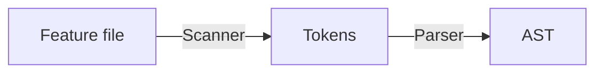
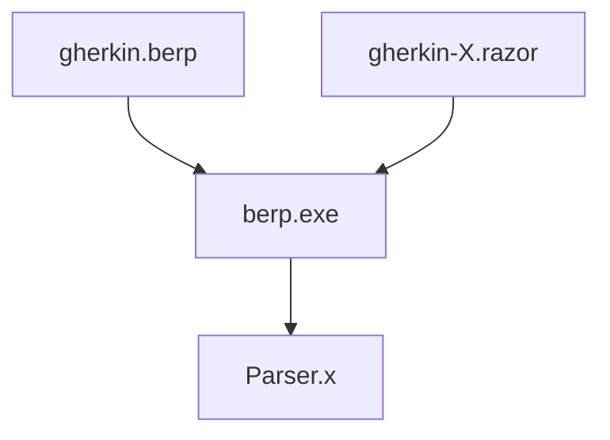
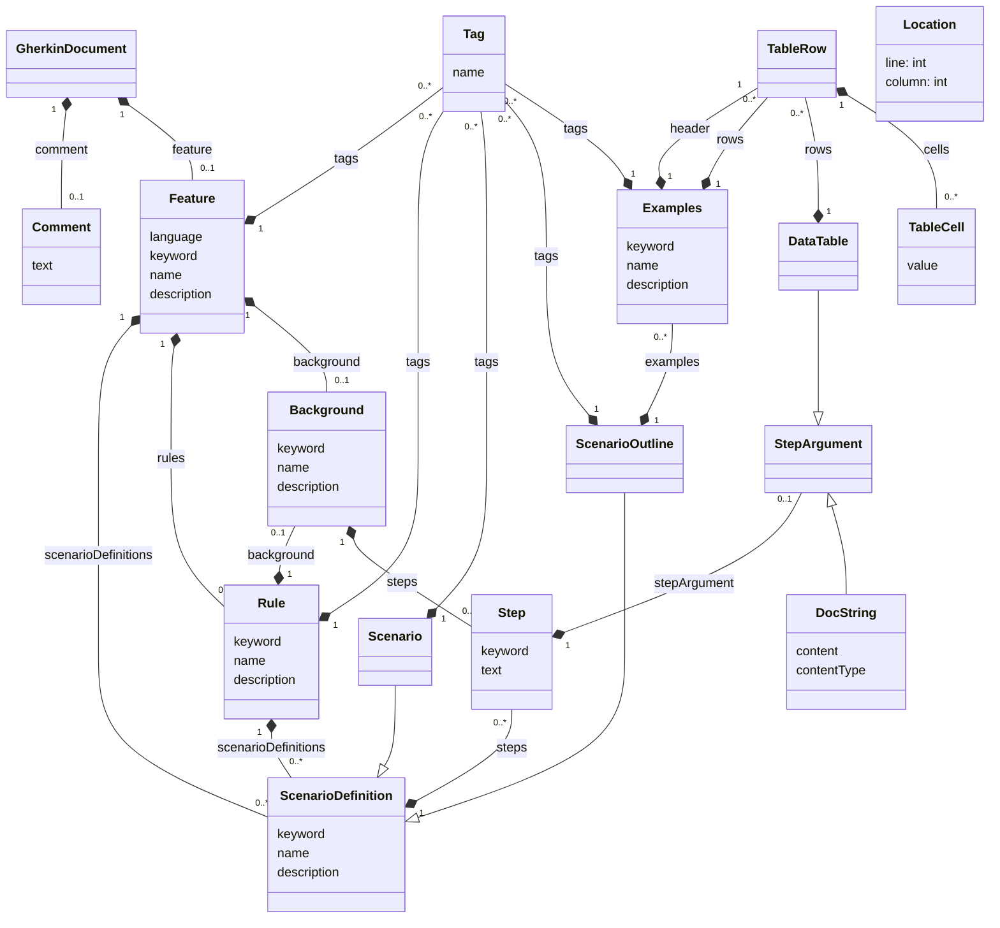
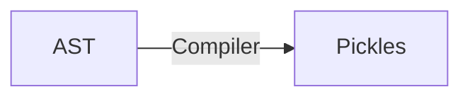

# Gherkin

Gherkin is a parser and compiler for the Gherkin language.

Gherkin is currently implemented for the following platforms (in order of birthday):

- [.NET](./dotnet) - [](./.github/workflows/test-dotnet.yml)
- [Java](./java) - [](./.github/workflows/test-java.yml)
- [JavaScript](./javascript) - [](./.github/workflows/test-javascript.yml)
- [Ruby](./ruby) - [](./.github/workflows/test-ruby.yml)
- [Go](./go) - [](./.github/workflows/test-go.yml)
- [Python](./python) - [](./.github/workflows/test-python.yml)
- [C](./c) - [](./.github/workflows/test-c.yml)
- [Objective-C](./objective-c) - _Currently not actively tested, requires maintenance_
- [Perl](./perl) - [](./.github/workflows/test-perl.yml)
- [PHP](./php) - [](./.github/workflows/test-php.yml)
- [Dart](./dart) - [](./.github/workflows/test-dart.yml)
- [C++](./cpp) - [](./.github/workflows/test-cpp.yml)

The CI will run using the linked workflow when that specific language implementation is changed

The CI will also run for any/all linked workflows when any [test data](./testdata) is modified
(For example modifying one of the good or bad features / ndjson outputs)

## Contributing Translations (i18n)

In order to allow Gherkin to be written in a number of languages, the keywords
have been translated into multiple languages. To improve readability and flow,
some languages may have more than one translation for any given keyword.

If you are looking to add, update or improve these translations please see
[`CONTRIBUTING.md`](CONTRIBUTING.md#adding-or-updating-an-i18n-language).

## Contributing a Parser Implementation

See [`CONTRIBUTING.md`](CONTRIBUTING.md) if you want to contribute a parser
for a new programming language. Our wish-list is (in no particular order):

- Rust

## Usage

Gherkin can be used either through its command line interface (CLI) or as a
library.

It is designed to be used in conjunction with other tools such as Cucumber
which consumes the output from the CLI or library as [Cucumber Messages](https://github.com/cucumber/messages).

### Library

Using the library is the preferred way to use Gherkin since it produces easily
consumable AST and Pickle objects in-process without having to fork a CLI process
or parse JSON.

The library itself provides a _stream_ API, which is what the CLI is based on.
This is the recommended way to use the library as it provides a high level API
that is easy to use. See the CLI implementations to get an idea of how to use it.

Alternatively, you can use the lower level parser and compiler. Some usage examples are below:

#### Java

```java
Path path = Paths.get("../testdata/good/minimal.feature");
GherkinParser parser = GherkinParser.builder().build();
Stream<Envelope> pickles = parser.parse(envelope).filter(envelope -> envelope.getPickle().isPresent());
```

#### C#

```csharp
var parser = new Parser();
var gherkinDocument = parser.Parse(@"Drive:\PathToGherkinDocument\document.feature");
```

#### Ruby

```ruby
require 'gherkin/parser'
require 'gherkin/pickles/compiler'

source = {
  uri: 'uri_of_the_feature.feature',
  data: 'Feature: ...',
  mediaType: 'text/x.cucumber.gherkin+plain'
}

gherkin_document = Gherkin::Parser.new.parse(source[:data])
id_generator = Cucumber::Messages::IdGenerator::UUID.new

pickles = Gherkin::Pickles::Compiler.new(id_generator).compile(gherkin_document, source)
```

#### JavaScript

```javascript
var Gherkin = require("@cucumber/gherkin");
var Messages = require("@cucumber/messages");

var uuidFn = Messages.IdGenerator.uuid();
var builder = new Gherkin.AstBuilder(uuidFn);
var matcher = new Gherkin.GherkinClassicTokenMatcher(); // or Gherkin.GherkinInMarkdownTokenMatcher()

var parser = new Gherkin.Parser(builder, matcher);
var gherkinDocument = parser.parse("Feature: ...");
var pickles = Gherkin.compile(
  gherkinDocument,
  "uri_of_the_feature.feature",
  uuidFn
);
```

#### Go

```go
// Download the package via: `go get github.com/cucumber/gherkin/go/v27`
//   && go get "github.com/cucumber/messages/go/v22"
import (
  "strings"

  gherkin "github.com/cucumber/gherkin/go/v27"
  messages "github.com/cucumber/messages/go/v22"
)

func main() {
  uuid := &message.UUID{} // or &message.Incrementing{}
  reader := strings.NewReader(`Feature: ...`)
  gherkinDocument, err := gherkin.ParseGherkinDocument(reader, uuid.NewId)
  pickles := gherkin.Pickles(*gherkinDocument, "minimal.feature", uuid.NewId)
}
```

#### Python

```python
from gherkin import Compiler, Parser

gherkin_document = Parser().parse("Feature: ...")
gherkin_document["uri"] = "uri_of_the_feature.feature"
pickles = Compiler().compile(gherkin_document)
```

#### Objective-C

```Objective-C
#import "GHParser+Extensions.h"

GHParser * parser = [[GHParser alloc] init];
NSString * featureFilePath; // Should refer to the place where we can get the content of the feature
NSString * content = [NSString stringWithContentsOfURL:featureFilePath encoding:NSUTF8StringEncoding error:nil];
if([content stringByTrimmingCharactersInSet:[NSCharacterSet whitespaceAndNewlineCharacterSet]].length == 0){
      // GHParser will throw an error if you passed empty content... handle this issue first.
}
GHGherkinDocument * result = [parser parseContent:content];
```

#### Perl

```perl
use Gherkin::Parser;
use Gherkin::Pickles::Compiler;

my $parser = Gherkin::Parser->new();
my $gherkin_document = $parser->parse("Feature: ...");
my $pickles = Gherkin::Pickles::Compiler->compile($gherkin_document);
```

#### PHP

```php
use Cucumber\Gherkin\GherkinParser;

$path = '/path/to/my.feature';

$parser = new GherkinParser();
$pickles = $parser->parseString(uri: $path, data: file_get_contents($path));
```

### CLI

The Gherkin CLI `gherkin` reads Gherkin source files (`.feature` files) and outputs
[ASTs](#abstract-syntax-tree-ast) and [Pickles](#pickles).

The `gherkin` program takes any number of files as arguments and prints the results
to `STDOUT` as [Newline Delimited JSON](https://jsonlines.org).

Each line is a JSON document that conforms to the [Cucumber Event Protocol](https://github.com/cucumber/messages).

To try it out, just install Gherkin for your favourite language, and run it over the
files in this repository:

```console
gherkin testdata/**/*.feature
```

Ndjson is easy to read for programs, but hard for people. To pretty print each JSON
document you can pipe it to the [jq](https://stedolan.github.io/jq/) program:

```console
gherkin testdata/**/*.feature | jq
```

## Table cell escaping

If you want to use a newline character in a table cell, you can write this
as `\n`. If you need a `|` as part of the cell, you can escape it as `\|`. And
finally, if you need a `\`, you can escape that with `\\`.

## Architecture

The following diagram outlines the architecture:



The _scanner_ reads a gherkin doc (typically read from a `.feature` file) and creates
a _token_ for each line. The tokens are passed to the _parser_, which outputs an _AST_
(Abstract Syntax Tree).

If the scanner sees a `#language` header, it will reconfigure itself dynamically
to look for Gherkin keywords for the associated language. The keywords are defined in
`gherkin-languages.json`.

The scanner is hand-written, but the parser is generated by the [Berp](https://github.com/gasparnagy/berp)
parser generator as part of the build process.

Berp takes a grammar file (`gherkin.berp`) and a template file (`gherkin-X.razor`) as input
and outputs a parser in language _X_:



### Abstract Syntax Tree (AST)

The AST produced by the parser can be described with the following class diagram:



Every class represents a node in the AST. Every node has a `Location` that describes
the line number and column number in the input file. These numbers are 1-indexed.

All fields on nodes are strings (except for `Location.line` and `Location.column`).

The implementation is simple objects without behaviour, only data. It's up to
the implementation to decide whether to use classes or just basic collections,
but the AST _must_ have a JSON representation (this is used for testing).

Each node in the JSON representation also has a `type` property with the name
of the node type.

You can see some examples in the
[testdata/good](https://github.com/cucumber/gherkin/tree/main/testdata/good)
directory.

### Pickles

The AST isn't suitable for execution by Cucumber. It needs further processing
into a simpler form called _Pickles_.

The compiler compiles the AST produced by the parser into pickles:



The rationale is to decouple Gherkin from Cucumber so that Cucumber is open to
support alternative formats to Gherkin (for example Markdown).

The simpler _Pickles_ data structure also simplifies the internals of Cucumber.
With the compilation logic maintained in the Gherkin library
we can easily use the same test suite for all implementations to verify that
compilation is behaving consistently between implementations.

Each `Scenario` will be compiled into a `Pickle`. A `Pickle` has a list of
`PickleStep`, derived from the steps in a `Scenario`.

Each `Examples` row under `Scenario Outline` will also be compiled into a `Pickle`.

Any `Background` steps will also be compiled into a `Pickle`.

Every tag, like `@a`, will be compiled into a `Pickle` as well (inheriting tags from parent elements
in the Gherkin AST).

Example:

```gherkin
@a
Feature:
  @b @c
  Scenario Outline:
    Given <x>

    Examples:
      | x |
      | y |

  @d @e
  Scenario Outline:
    Given <m>

    @f
    Examples:
      | m |
      | n |
```

Using the [CLI](#cli) we can compile this into several pickle objects:

```console
gherkin testdata/good/readme_example.feature --no-source --no-ast | jq
```

Output:

```json
{
  "type": "pickle",
  "uri": "testdata/good/readme_example.feature",
  "pickle": {
    "name": "",
    "steps": [
      {
        "text": "y",
        "arguments": [],
        "locations": [
          {
            "line": 9,
            "column": 7
          },
          {
            "line": 5,
            "column": 11
          }
        ]
      }
    ],
    "tags": [
      {
        "name": "@a",
        "location": {
          "line": 1,
          "column": 1
        }
      },
      {
        "name": "@b",
        "location": {
          "line": 3,
          "column": 3
        }
      },
      {
        "name": "@c",
        "location": {
          "line": 3,
          "column": 6
        }
      }
    ],
    "locations": [
      {
        "line": 9,
        "column": 7
      },
      {
        "line": 4,
        "column": 3
      }
    ]
  }
}
{
  "type": "pickle",
  "uri": "testdata/good/readme_example.feature",
  "pickle": {
    "name": "",
    "steps": [
      {
        "text": "n",
        "arguments": [],
        "locations": [
          {
            "line": 18,
            "column": 7
          },
          {
            "line": 13,
            "column": 11
          }
        ]
      }
    ],
    "tags": [
      {
        "name": "@a",
        "location": {
          "line": 1,
          "column": 1
        }
      },
      {
        "name": "@d",
        "location": {
          "line": 11,
          "column": 3
        }
      },
      {
        "name": "@e",
        "location": {
          "line": 11,
          "column": 6
        }
      },
      {
        "name": "@f",
        "location": {
          "line": 15,
          "column": 5
        }
      }
    ],
    "locations": [
      {
        "line": 18,
        "column": 7
      },
      {
        "line": 12,
        "column": 3
      }
    ]
  }
}
```

Each `Pickle` event also contains the path to the original source. This is useful for
generating reports and stack traces when a Scenario fails.

Cucumber will further transform this list of `Pickle` objects to a list of `TestCase`
objects. `TestCase` objects link to user code such as Hooks and Step Definitions.

## Building Gherkin

See [`CONTRIBUTING.md`](CONTRIBUTING.md)

## Markdown with Gherkin

See [Markdown with Gherkin](./MARKDOWN_WITH_GHERKIN.md).

## Projects using Gherkin

- [cucumber-jvm](https://github.com/cucumber/cucumber-jvm)
- [cucumber-ruby](https://github.com/cucumber/cucumber-ruby)
- [cucumber-js](https://github.com/cucumber/cucumber-js)
- [godog](https://github.com/cucumber/godog)
